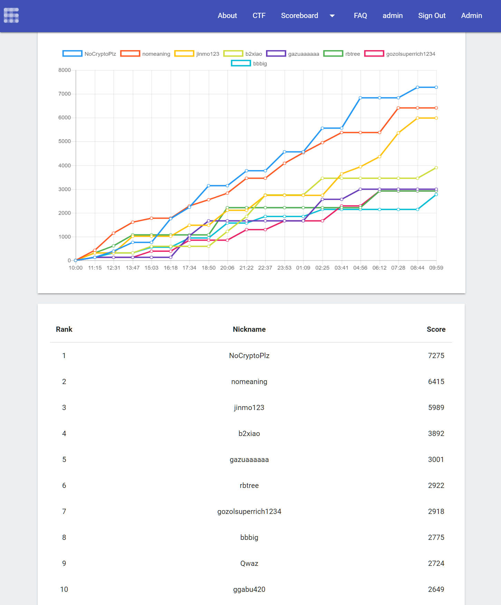

# Samsung CTF 18
Samsung CTF 2018 by KaisHack

# Site
- https://research.samsung.com/sctf2018

# Qual
For the qualification round, please visit
[sctf2018_qual](https://github.com/kaishack/sctf2018_qual)

# Final Score

# Final Challenges

### Attack (9)
 - [memo](./attack/memo)
 - [heapXheap](./attack/HEAP_BY_HEAP)
 - [Shellfuzz](./attack/shellfuzz)
 - [RSS](./attack/RSS)
 - [Ghost in the Speculator](./attack/Ghost_in_the_Speculator)
 - [Millionaire](./attack/Millionaire)
 - [disposable](./attack/disposable)
 - [RemoteChatService](./attack/RemoteChatService)
 - [RDiary](./attack/R-diary)

### Defense (4)
 - [ABC](./defense/ABC)
 - [Scan](./defense/SDN-Scan)
 - [OverflowChecker](./defense/OverflowChecker)
 - [Flood](./defense/SDN-Flood)

### Coding & Misc (4)
 - [HumanDetector](./coding/HumanDetector)
 - [λ: Power](./coding/Lambda_Power)
 - [MultiLingual](./coding/MultiLingual)
 - [SuperSonic](./coding/SuperSonic)

### Reversing (4)
 - [Baby TPK](./reversing/BabyTPK)
 - [Speculator](./reversing/Speculator)
 - [F\#oker](./reversing/F%23oker)
 - [SObfuscator](./reversing/SObfuscator)

### Crypto (4)
  - [LCG](./crypto/LCG)
  - [SaltyDSA](./crypto/SaltyDSA)
  - [MQ](./crypto/MQ)
  - [polyPKC](./crypto/polyPKC)

